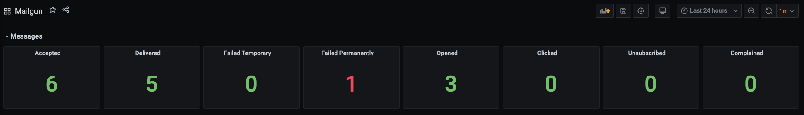

# Prometheus Exporter for Mailgun ✉️

[](https://goreportcard.com/report/github.com/DenBeke/mailgun-exporter)
[](https://hub.docker.com/r/denbeke/mailgun-exporter)

Prometheus exporter to fetch metrics from Mailgun API.


## Run with Docker

You can use the [docker-compose.yml](./docker-compose.yml) file:

```yaml
version: "3"
services:
  mailgun-exporter:
    container_name: mailgunexporter
    image: denbeke/mailgun-exporter
    ports:
      - "9999:9999"
    environment:
      - MAILGUN_REGION=EU
      - MAILGUN_PRIVATE_API_KEY=<your-mailgun-key>
```

ℹ️ Don't forget to specify the correct region (`US` or `EU`). Otherwise you might not see your domains.


## Run in Development

    env MAILGUN_REGION=EU MAILGUN_PRIVATE_API_KEY=<your-mailgun-key> go run cmd/mailgunexporter/*.go


## Available metrics

The following metrics are available at `:9999/metrics`:

- `mailgun_accepted_total`
- `mailgun_delivered_total`
- `mailgun_failed_temporary_total`
- `mailgun_failed_permanently_total`
- `mailgun_opened_total`
- `mailgun_clicked_total`
- `mailgun_complained_total`
- `mailgun_unsubscribed_total`
- `mailgun_stored_total`

All metrics have `domain` as a label.


## Grafana Dashboard

A Grafana dashboard for these metrics is available here: [./grafana/dashboard.json](grafana/dashboard.json)

[](grafana/dashboard.png)


## Author

[Mathias Beke](https://denbeke.be)